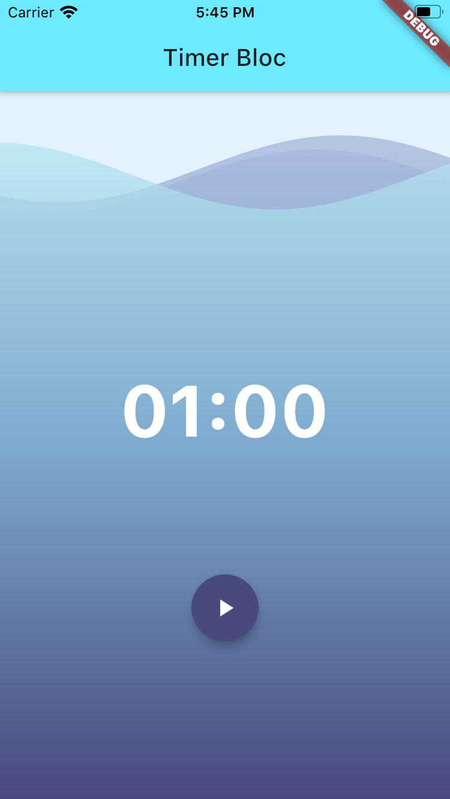
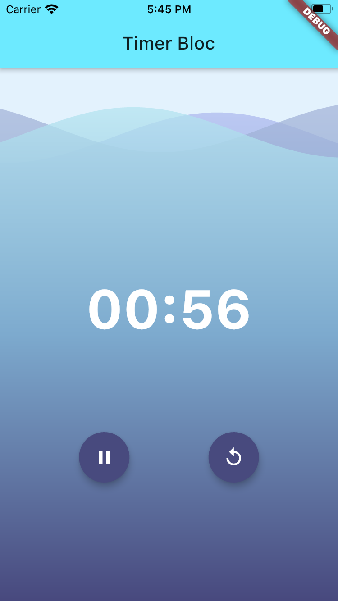

# timer_bloc

A new Flutter project to demonstrate use of BLoC pattern. In this we followed following steps:
1. Created data provider class, Ticker
2. TimerState - Ready, Running, Paused, Finished. Class has `int duration`.
3. TimerEvent - Start, Pause, Resume, Reset, Tick. Class has `int duration`.
4. TimerBloc - Uses above two, sets `initialState` and `mapEventToState()`.
   - Here we also created `StreamSubscription` for tickerSubscription. 
     - this has `pause()` and `resume()` functions.
   - Used, `close()` to cancel the subscription.
5. Exported all these classes to `bloc.dart`.
6. UI - main.dart - we created, `home: BlocProvider()` to manage initializing and closing an instance of TimerBloc.
7. Then, `BlocBuilder<TimerBloc, TimerState>()` to show timer.
8. Then, added floating action buttons based on state.
9. Then, wrapped it in stack and added `wave` background widget.

Screenshots:
 | 
:-:|:-:
Initial State|Timer Started

App Structure:
- lib
  - bloc
    - bloc.dart
    - timer_bloc.dart
    - timer_event.dart
    - timer_state.dart
  - resources
    - repository
      - ticker.dart
  - main.dart

This project was based on Bloc [tutorial](https://bloclibrary.dev/#/fluttertimertutorial?id=ticker) by @felangel.

Thank you!